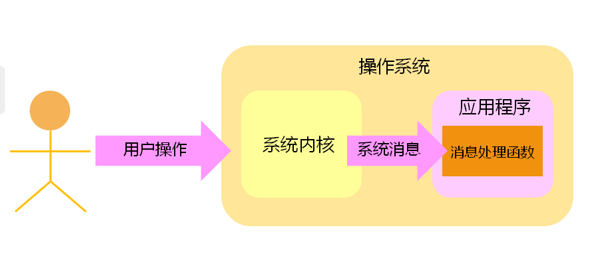
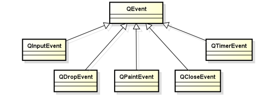
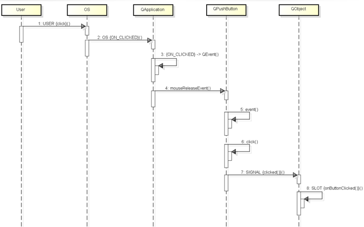
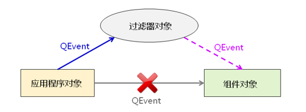

- [GUI程序原理回顾](#gui程序原理回顾)
- [QT中的事件处理](#qt中的事件处理)
    - [GUI程序的事件处理方式](#gui程序的事件处理方式)
    - [事件和信号的区别](#事件和信号的区别)
    - [```QEvent```中的关键成员函数](#qevent中的关键成员函数)
    - [QT的事件过滤器](#qt的事件过滤器)

# GUI程序原理回顾

图形界面程序的消息处理模型



**思考: 操作系统发送的消息如何转变成QT信号**

# QT中的事件处理

QT平台将系统产生的消息转换为QT事件

* QT事件是一个```QEvent``` 的对象

* QT事件用于描述程序内部或外部发生的动作

* 任意的```QObject``` 对象都具备事件处理能力



### GUI程序的事件处理方式

* QT事件产生后立即被分配到```QWidget```对象
* ```QWidget``` 中的```event(QEvent*)```进行事件处理
* ```event()```根据事件类型调用不同事件处理函数
* 在事件函数中发送QT信号
* 调用相关槽函数


 

 ### 事件和信号的区别
* 事件是由具体对象进行处理
* 信号是由具体对象主动产生
* 改写事件处理函数可能导致程序行为发生改变
* 信号是否存在对应的处理函数都不会改变程序行为
* 一般来说, 信号在具体的事件处理中产生

### ```QEvent```中的关键成员函数

* ```void ignore()``` 接收者忽略当前事件, 事件可能传递给父组件
* ```void accept()``` 接收者接收改事件
* ```bool isAccepted()``` 判断事件是否被处理
> 测试看起来如果不显式调用```igonre()```的话, 也不会传递到父组件

```C++
#include "MyLineEdit.h"
#include <QDebug>
#include <QEvent>
#include <QKeyEvent>

MyLineEdit::MyLineEdit(QWidget *parent) :
    QLineEdit(parent)
{
}

bool MyLineEdit::event(QEvent* e)
{
    if( e->type() == QEvent::KeyPress )
    {
        qDebug() << "MyLineEdit::event";
    }

    return QLineEdit::event(e);
}

void MyLineEdit::keyPressEvent(QKeyEvent* e)
{
    qDebug() << "MyLineEdit::keyPressEvent";

    QLineEdit::keyPressEvent(e);

    e->ignore();
}

```

```C++
#include "Widget.h"
#include <QDebug>
#include <QEvent>

Widget::Widget(QWidget *parent)
    : QWidget(parent), myLineEdit(this)
{
}

bool Widget::event(QEvent* e)
{
    if( e->type() == QEvent::KeyPress )
    {
        qDebug() << "Widget::event";
    }

    return QWidget::event(e);
}

void Widget::keyPressEvent(QKeyEvent* e)
{
    qDebug() << "Widget::keyPressEvent";

    QWidget::keyPressEvent(e);
}

Widget::~Widget()
{ 
}
```

### QT的事件过滤器

* 事件过滤器可以监控其他组件接收到的事件
* 任意的```QObject```对象都可以作为事件过滤器使用
* 事件过滤器需要重写```eventFilter()```
* 组件通过```installEventFilter()```安装事件过滤器
  * 事件过滤器会在组件<font color=red>**之前**</font>接收到事件、
  * 事件过滤器能**决定事件是否将事件转发到组件对象**
  
  

  代码实现：
  ```C++
    // 返回true 表示事件已经处理, 不会传递到obj
    // 返回false s会传递到obj
    bool eventFilter(QObject* obj, QEvent* e)
    {
        if(/* 根据obj判断对象*/)
        {
            if(/*根据e->type() 判断事件类型*/)
            {

            }
        }
        return QWidget::eventFilter(obj, e);
    }
  ```