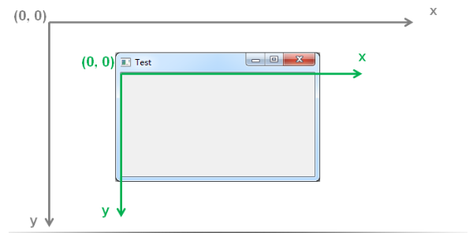
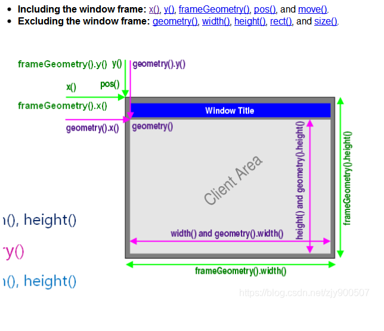

- [坐标系统](#坐标系统)

# 坐标系统

1. GUI操作系统都有自己特定的坐标系统

2. 图形界面程序在坐标系统中进行窗口和部件定位

3. 定位类型
   
   * 顶层窗口部件定位
   
   *  窗口内部定位
   
   * 窗口部件大小定位

4. QT的坐标系统
   
   * QT 使用统一的坐标系统定位窗口部件进行定位
   
   * QT部件类提供成员函数在坐标系统中进行定位
   
   * ```QWidget```类提供窗口部件所需的坐标系统成员函数



# 坐标系统中的成员函数


