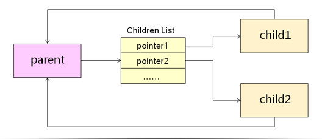
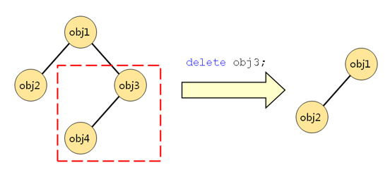

* [QT对象间关系](#QT对象间关系)

# QT对象间关系

**问题: 在QT创建窗口组件时候, 是直接从堆中创建出来,但是没看见对应的delete, 是否存在内存泄漏?**

QT对象间可以存在父子关系

* 每个对象都保存它所有子对象指针

* 每个子对象都保存父对象的指针



```cpp
    QObject* p1 = new QObject();
    QObject* p2 = new QObject();
    QObject* p3 = new QObject();

    p2->setParent(p1);
    p3->setParent(p1);

    p1->dumpObjectTree();
```

当对象被销毁时

* 将自己从父对象中的**对象树**中移除

* 将自己的对象书中的**所有对象**销毁

> 注意: 在开发时 不仅要注意内存泄漏, 还要注意对象是否被<font color=red>**多次释放**</font>问题

利用QT对象间的父子关系可以构成对象树

删除树中的节点时也会导致子树被销毁


