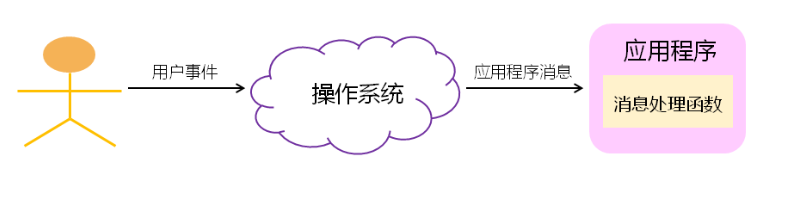
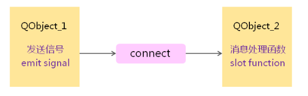

* [QT消息模型](#QT消息模型)
  * [信号与槽](#信号与槽)

# QT消息模型

1. QT封装了具体操作系统的消息机制

2. QT遵循经典的GUI消息驱动事件模型



## 信号与槽

QT 中定义了与系统消息相关的概念

* 信号 :  由操作系统产生的消息

* 槽     :  程序中消息处理函数

* 链接 :  将系统消息消息处理函数

QT的消息处理机制 (信号到槽的链接必须发生到两个QT对象之间)



### **QT的核心 QObject::connect函数**

```cpp
static QMetaObject::Connection connect(
            const QObject *sender,  // 发送对象
            const char *signal,     // 发送信号
            const QObject *receiver, // 接收对象
            const char *member,      // 接受处理函数
            Qt::ConnectionType = Qt::AutoConnection);
```

QT核心关键字：

* `SIGNAL` 用于指定消息名

* ```SLOT``` 指定消息处理函数

* ```Q_OBJECT``` **所有自定义槽的类都必须在类中加上**

对于```connect```QT有几种用法, 以按键连接槽为例

在QT5前:

```cpp
QObject::connect(&button, SIGNAL(clicked()), this, SLOT(on_clicked));
```

QT5后:

```cpp
QObject::connect(&button, &QPushButton::clicked, this, &Window::on_clicked);
```

> 注意QT5这种方式有一个问题, 如果出现信号重载的情况下, 这里QT时分辨不出使用哪个重载信号的, 所以, 如果使用重载信号, 那么就用QOverload, 如下方法

```cpp
QObject::connect(
            &button, 
            QOverload<QPushButton*>::of(&QPushButton::clicked),
            this, 
            QOverload<QPushButton*>::of(&Window::on_clicked));
```

### 注意事项

**解决经典问题QObject::connect： NO such slot**

* 检查类是否继承 ```QObject```

* 类内是否加上```Q_Object```

* 重新 ````qmake```

* 检查拼写
