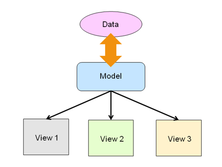
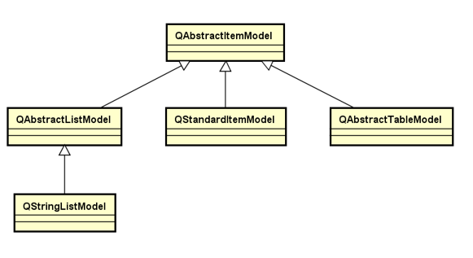
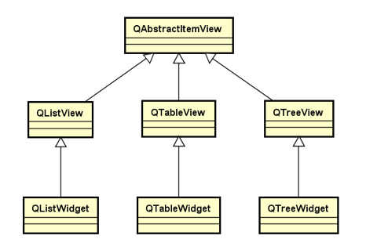
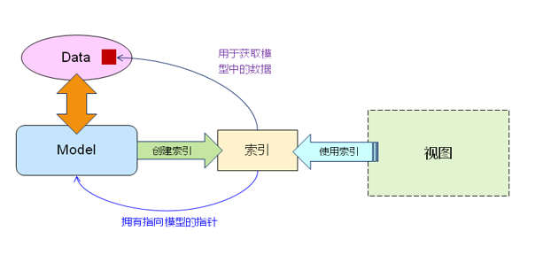
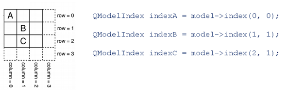
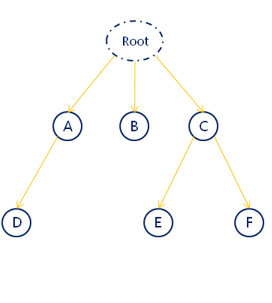
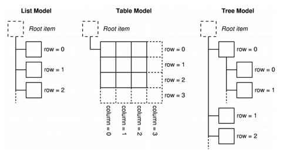
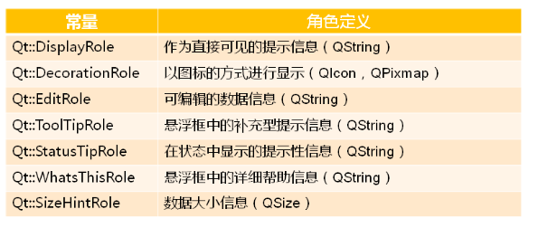

- [模型视图设计模式](#模型视图设计模式)
  - [模型视图设计模式的核心思想](#模型视图设计模式的核心思想)
  - [模型视图的工作机制](#模型视图的工作机制)
  - [模型与视图的类层次](#模型与视图的类层次)
  - [疑问](#疑问)
- [模型中的索引](#模型中的索引)
  - [线索中的行和列](#线索中的行和列)
    - [疑问](#疑问-1)
  - [通用模型数据索引方式](#通用模型数据索引方式)
  - [数据角色](#数据角色)
    - [数据角色的意义](#数据角色的意义)

# 模型视图设计模式

## 模型视图设计模式的核心思想

* 模型(**数据**)和视图(**显示**)分离
* 模型对外提供标准接口存取数据(**不关心如何显示**)
* 视图自定义数据显示方式(**不关心数据如何存储**)



## 模型视图的工作机制
* 当数据发送变更时, 模型发出信号通知视图
* 当用户与视图进行交互时, 视图发出信号提供交互信息

## 模型与视图的类层次





## 疑问
<font color=red>问题: 模型时如何为数据供统一标准方式</font>

使用**索引**
* 在QT中, 不管模型以什么结构组织数据, 都必须为每一个数据提供**唯一**的索引
* 视图通过索引访问模型中的数据

```C++
    QFileSystemModel fsModel;
    QTreeView treeView;

    treeView.setParent(this);
    treeView.move(10, 10);
    treeView.resize(500, 300);
    fsModel.setRootPath(QDir::currentPath());
    treeView.setModel(&m_fsModel);
    treeView.setRootIndex(m_fsModel.index(QDir::currentPath()));
```

简单总结:
* 模型用于组织数据
* 视图用于定义数据的显示方式
* 模型中必须为每个数据提供唯一的索引
* 视图只能通过索引访问模型的数据

# 模型中的索引

* 模型的索引时数据与视图分离的重要机制
* 模型中的数据只能用索引访问
* ```QModelIndex```是QT中的模型索引类



> 模型索引其实就是给视图获取数据的统一接口标准

## 线索中的行和列
* 线性模型可以使用```row```和```column```作为数据索引



### 疑问
问题: 只有行和列能索引是否足够通用?

肯定不够

思考:如何索引以树状结构的数据

* 虚拟一个```root```节点, 统一所有数据到同一个树中
* 同一父节点的字节点递增编号
* 通过```(index, parent)```方式访问节点



## 通用模型数据索引方式

* 以三元组方式



> 注意: 当访问的父节点是虚拟根节点时, 使用空索引```QModelIndex()```作为参数

示例:
```C++
QStringList list{"111", "aaa", "bbb", "ccc"};
QStringListModel model(list);

for(int i = 0; i < model.rowCount(); i++)
{
    QModelIndex idx = model.index(i, 0);
    qDebug()<< idx.data().type()<< ": "<< idx.data().toString();
}
```

## 数据角色

问题: 不同视图如何显示同一模型的数据? 

* 视图根据索引从模型取到数据, 拿到的数据就可以显示

示例：

```C++
QStandardItem* root = m_model.invisibleRootItem();
QStandardItem* itemA = new QStandardItem();
QStandardItem* itemB = new QStandardItem();
QStandardItem* itemC = new QStandardItem();
QStandardItem* itemChild = new QStandardItem();

itemA->setData("A");
itemA->setData("Tip A");
itemA->setData("Help A");

itemC->setData("C");
itemC->setData("Tip C");
itemC->setData("Help C");

itemChild->setData("Child");
itemChild->setData("Tip Child");
itemChild->setData("Help Child");

itemC->setChild(0, 0, itemChild);

root->setChild(0, 0, itemA);
root->setChild(1, 0, itemC);
```

从上面代码运行得到的却是 **视图并没有显示数据**, 这是为什么?

分析:
* 视图根据索引从模型取到数据
* 但是, 视图拿到数据后, <font color=red>**并不知道怎么显示**</font>

数据角色的概念:
* 模型中的数据在视图中的显示方式有可能不同
* 模型必须为每个数据设置特定的数据角色
* 数据角色用于告诉视图数据的作用
* 数据角色是不同视图以统一风格显示数据的标准




### 数据角色的意义

* 定义了数据在不同系统下的标准用途
* 不同的视图以相同的标准显示数据

> 注意 数据角色只是一个附加属性, 代表推荐的显示方式
> 不同视图完全可以忽略这个属性自由解析