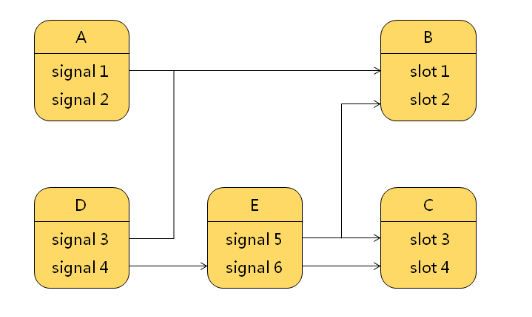

- [深入理解信号和槽](#深入理解信号和槽)
  - [信号本质](#信号本质)
    - [信号只是特殊的成员函数声明](#信号只是特殊的成员函数声明)
    - [信号必须使用```signals```关键字声明](#信号必须使用signals关键字声明)
  - [信号槽关系](#信号槽关系)
  - [QT不可忽视的军规](#qt不可忽视的军规)
  - [信号槽的意义](#信号槽的意义)


# 深入理解信号和槽

一个事实:  
在项目中, 大多数时候组件中预定义的信号都会连接到槽, 发送信号后槽函数被调用

深度思考:  
 **信号怎么来的 又是如何发送**

## 信号本质
### 信号只是特殊的成员函数声明

* 函数返回值是```void```
* 函数只能声明不能定义

### 信号必须使用```signals```关键字声明
* 函数的访问属性被**自动**设置为```protected```
* 只能通过 ```emit```关键字调用

> 本质上, 这些QT自定义的关键字 能被编译, 是因为在编译器前, 会用自家研发的qmake工具先编译一遍, 生成一份 ```moc_xxx```的文件, 里面就是信号槽以及各个QT特性的具体实现

## 信号槽关系



* 一个信号可以连接多个槽
* 多个信号可以连接一个槽
* 一个信号可以连接另外一个信号
* 连接可以主动断开

## QT不可忽视的军规

* QT类只能在头文件声明
* 信号槽的原型是相同的
* 信号参数多于槽函数参数时, 多余的会忽略
* 槽函数必须返回```void```
* 槽函数可以向正常函数被调用
* 信号槽的访问属性对于```connect/disconnect```无效

## 信号槽的意义
* 最大限度弱化类间耦合
* 设计阶段减少接口类
* 开发阶段类间可以通过信号槽进行动态绑定

