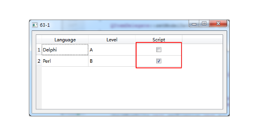

- [深入解析视图与委托](#深入解析视图与委托)

# 深入解析视图与委托

深度思考: 委托是视图的构成部分, 那么委托是否帮助视图具体显示数据?

分析:
* QT中的委托作为视图的内部组件, 必然需要承担显示的部分工作

结论: 
* 视图负责确定数据显示组织方式
* 委托显示具体数据和编辑
* 视图与委托共同完成数据显示和编辑

问题: 如何改变视图默认显示方式



* 重写委托的的```paint()```, 在```paint()```中自定义数据显示方式
* 重写```editorEvent()```, 并在```editorEvent()```中处理交互


```C++
void CustomizedItemDelegate::paint(QPainter *painter, const QStyleOptionViewItem &option, const QModelIndex &index) const
{
    if(index.data().typeId() == QMetaType::Bool)
    {
        QStyleOptionButton box;

        box.rect = option.rect;
        box.rect.setX(option.rect.x() + option.rect.width() / 2);

        box.state = QStyle::State_Enabled;
        box.state |= index.data().toBool() ? QStyle::State_On : QStyle::State_Off;

        QApplication::style()->drawControl(QStyle::CE_CheckBox, &box, painter, NULL);
    }
    else
    {
        QItemDelegate::paint(painter, option, index);
    }
}

bool CustomizedItemDelegate::editorEvent(QEvent *event, QAbstractItemModel *model, const QStyleOptionViewItem &option, const QModelIndex &index)
{
    bool ret = true;

    if(event->type() == QEvent::MouseButtonRelease)
    {
        QMouseEvent* e = dynamic_cast<QMouseEvent*>(event);

        if(index.data().typeId() == QMetaType::Bool && option.rect.contains(e->pos()))
        {
            model->setData(index, !index.data().toBool(), Qt::DisplayRole);
        }

        qDebug()<< "editorEvent";
    }
    else
    {
        QItemDelegate::editorEvent(event, model, option, index);
    }

    return ret;
}
```