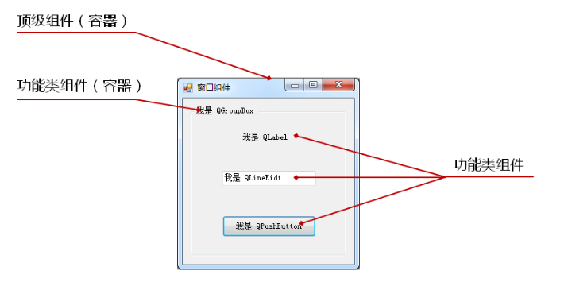

* [窗口组件](#窗口组件)
* [窗口类型](#窗口类型)

# 窗口组件

## 组件的介绍

* 图形用户界面由不同类型的窗口和窗口组件构成

* `<QtGui>`头文件包含窗口组件，对应Qt中的GUI模块

* Qt以组件对象的方式构建图形用户界面

## 组件的类型

* 容器类（父组件）：用于包含其它的界面组件（Qt中没有父组件的顶级组件叫做窗口）

* 功能类（子组件）：用于实现特定的交互功能

## 具体组件

* **QWidget组件** : 
  
  * Qwidget类继承自QObject和QPaintDevice类
  
  * QWidget能够绘制自己和处理用户输入
  
  * QWidget能够绘制自己和处理用户输入
  
  * **QWidget是Qt中所有窗口组件类的父类（super class）**
  
  * **QWidget是所有窗口组件的的抽象**
  
  * **Qt的每个窗口组件都是一个QWidget**
  
  * **QWidget类对象常作为父组件或顶级组件使用**

* **QObject是所有支持Qt对象的基类**

* **QPaintDevice是Qt中所有可绘制组件的基类**

# 窗口类型

可以在QT帮助文档查``Qt::WindowType``看到具体类型
