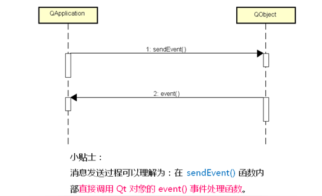

- [在程序中发送事件](#在程序中发送事件)
- [自定义事件对象](#自定义事件对象)
    - [为什么需要自定义事件类](#为什么需要自定义事件类)

# 在程序中发送事件

QT可以在程序中自主发送事件
  * 阻塞型事件发送
    > 事件发送后需要等待事件处理完成
  * 非阻塞型事件发送
    > 事件发送后立即返回
    > 事件发送到事件队列中等待处理

```QApplication```提供了支持事件发送的静态函数

  * 阻塞型
    ```C++
    QApplication::sendEvent(QObject* recevier, QEvent* event); 
    ```
    > sendEvent 中事件对象的生命周期是由程序自身管理, event可以是**栈上或堆上**的对象

    

  * 非阻塞型
    ```C++
    QApplication::postEvent(QObject* recevier, QEvent* event); 
    ```
    > postEvent 中事件对象的生命周期是由QT框架管理, event必须是**堆上**的对象, 
    > 并且由QT框架来管理释放, **所以postEvent后对于event使用必须小心**

    

```C++
#include "Widget.h"
#include <QMouseEvent>
#include <QApplication>
#include <QDebug>

Widget::Widget(QWidget *parent)
    : QWidget(parent)
{
    m_pushButton.setParent(this);
    m_pushButton.setText("Test");

    connect(&m_pushButton, SIGNAL(clicked()), this, SLOT(onButtonClicked()));
}

void Widget::onButtonClicked()
{
    // testSendEvent();
    testPostEvent();
}

void Widget::testSendEvent()
{
    QMouseEvent dbcEvt(QEvent::MouseButtonDblClick, QPoint(0, 0), Qt::LeftButton, Qt::NoButton, Qt::NoModifier);

    qDebug() << "Before sendEvent()";

    QApplication::sendEvent(this, &dbcEvt);

    qDebug() << "After sendEvent()";
}

void Widget::testPostEvent()
{
    QMouseEvent* dbcEvt = new QMouseEvent(QEvent::MouseButtonDblClick, QPoint(0, 0), Qt::LeftButton, Qt::NoButton, Qt::NoModifier);

    qDebug() << "Before postEvent()";

    QApplication::postEvent(this, dbcEvt);

    qDebug() << "After postEvent()";
}

bool Widget::event(QEvent* evt)
{
    if( evt->type() == QEvent::MouseButtonDblClick )
    {
        qDebug() << "event(): " << evt;
    }

    return QWidget::event(evt);
}

Widget::~Widget()
{ 
}
```

# 自定义事件对象

 QT可以自定义新的事件类

 * 自定义的事件类必须继承自```QEvent```
 * 自定义的事件类必须**拥有全局唯一的type值**
 * 程序中必须提供提供处理自定义事件对象的方法(QT不知道如何处理)

```c++
class MyEvent : public QEvent
{
public:
    MyEvent() : QEvent(MY_TYPE){}
private:
    static const Type MY_TYPE = static_cast<Type>(QEvent::User + 0x11);
};
```
QT事件中的```Type```值
* 每个事件类都拥有全局唯一的```Type```
* 自定义事件类也需要自定义```Type```值
* 自定义事件类的```Type```值**必须是```QEvent::User```之后作为```Type```值**
* **必须保证每个每个```Type```值是全局唯一的**

处理自定义事件对象的方法
* 将事件过滤器安装到目标对象
  > 在```evevntFilter```中处理自定义事件
* 在目标对象的类中重写事件处理函数
  > 在```event()```中处理自定义事件

```C++
#include <QWidget>
#include <QPushButton>
#include <QDebug>
#include <QApplication>

class MyEvent : public QEvent
{
public:
    MyEvent() : QEvent(MY_TYPE){}
private:
    static const Type MY_TYPE = static_cast<Type>(QEvent::User + 0x11);
};

class MyButton : public QPushButton
{
    Q_OBJECT
protected:
    virtual bool event(QEvent* e) override
    {
        bool ret = false;
        static int i = 0;

        if(e->type() == QEvent::User + 0x11)
        {
            qDebug()<< "get self-definition";
            setStyleSheet(QString("background-color: %1").arg(i++ % 2 ? "red" : "green"));
            ret = true;
        }
        else
        {
            ret = QPushButton::event(e);
        }

        return ret;
    }
public:
    MyButton(QWidget* parent = nullptr) : QPushButton(parent){}
};

class MyWidget : public QWidget
{
    Q_OBJECT
public:
    MyWidget(QWidget* parent = nullptr) : QWidget(parent), _button(this), _button2(this)
    {
        setFixedSize(200, 200);
        _button.setGeometry(10, 10, 50, 30);
        _button.setText("B1");
        _button2.setGeometry(100, 10, 50, 30);
        _button2.setText("B2");

        connect(&_button2, &QPushButton::clicked, this, &MyWidget::onClick);
    }
public slots:
    void onClick()
    {
        MyEvent* ev = new MyEvent();
        QApplication::postEvent(&_button, ev);
    }
private:
    MyButton _button;
    QPushButton _button2;
};
```

### 为什么需要自定义事件类

* 需要扩展已有组件类
* 需要开发一个新功能的组件类
* 等等