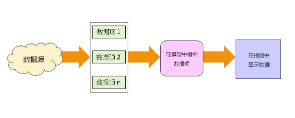

- [自定义模型类](#自定义模型类)
  - [工程中的常见模型设计](#工程中的常见模型设计)
    - [实战分析:](#实战分析)

# 自定义模型类

```QStandardItemModel```是一个通用的模型类

* 能够以任意方式组织数据
* 数据单位为**数据项(```QStandardItem```)**
* 每个数据项能存储多个数据(包括数据角色)
* 每个数据项能够对数据进行控制(编辑 可选...)


Qt中变态类型```QVariant```
* ```QVariant```是封装类型的类
* ```QVariant```能表示大多数常见的值类型
* ```QVariant```没次只能保存一个类型的值
* ```QVariant```的意义是能够设计返回类型的可变函数

## 工程中的常见模型设计

* 解析数据源中的数据(网络 串口 数据库...)
* 将解析后的数据存入```QStandardItem```中
* 根据数据间的关系在```QStandardItemModel```中组织数据
* 选择合适的视图进行显示



### 实战分析:
* 以文件形式存储了考试的信息
* 开发GUI显示考试信息


* ```DataSource```用于设置数据源并解析数据, 生成数据对象
* ```ScoreInfo``` 封装一组完整的数据
* ```ScoreInfoModel```用```QStandardItemModel```作为成员, 以```ScoreInfo```为数据单位


```C++
class DataSource
{
public:
    DataSource();

    bool setDataPath(const QString& path);

    QList<ScoreInfo> fetchData();

    int count() const;

private:
    bool parse(const QString& line);

    QList<ScoreInfo> _list;
};
```
```C++
bool DataSource::setDataPath(const QString& path)
{
    bool ret = false;
    QFileInfo qf(path);

    if(qf.isFile())
    {
        QFile file(path);
        if(file.open(QFile::ReadOnly))
        {
            QTextStream s(&file);

            ret = true;

            while(!s.atEnd() && ret)
            {
                QString l = s.readLine();

                ret = parse(l);
            }
        }
    }

    if(!ret)
    {
        QMessageBox::critical(nullptr, "error", "the file is invaild!");
    }

    return ret;
}

QList<ScoreInfo> DataSource::fetchData()
{
    QList<ScoreInfo> ret = _list;

    _list.clear();

    return ret;
}

int DataSource::count() const
{
    return _list.count();
}

bool DataSource::parse(const QString& line)
{
    bool ret = true;

    QStringList list = line.split(',', Qt::SkipEmptyParts);

    ret = list.count() == 3;

    if(ret)
    {
        _list.emplace_back(list[0], list[1], list[2]);
    }

    return ret;
}
```

```C++
class ScoreInfo
{
public:
    ScoreInfo();
    ScoreInfo(QString name, QString course, QString score);
    ScoreInfo(const ScoreInfo& obj);
    ScoreInfo& operator = (const ScoreInfo& obj);

    QString name() const;
    QString course() const;
    QString score() const;
private:
    QString _name;
    QString _course;
    QString _score;
};
```

```C++
ScoreInfo::ScoreInfo(QString name, QString course, QString score)
{
    _name = name;
    _course = course;
    _score = score;
}

ScoreInfo::ScoreInfo(const ScoreInfo& obj)
{
    *this = obj;
}

ScoreInfo& ScoreInfo::operator = (const ScoreInfo& obj)
{
    if(this != &obj)
    {
        this->_name = obj._name;
        this->_course = obj._course;
        this->_score = obj._score;
    }

    return *this;
}

QString ScoreInfo::name() const
{
    return _name;
}

QString ScoreInfo::course() const
{
    return _course;
}

QString ScoreInfo::score() const
{
    return _score;
}
```

```C++
class ScoreInfoModel : public QObject
{
    Q_OBJECT
public:
    explicit ScoreInfoModel(QObject *parent = nullptr);

    void setView(QAbstractItemView* view);

    bool add(const ScoreInfo& info);

    bool add(QList<ScoreInfo> list);

    bool remove(int i);

    ScoreInfo getItem(int i) const;

    int count() const;

    void clear();
private:
    QStandardItemModel _model;
};
```

```C++
ScoreInfoModel::ScoreInfoModel(QObject *parent)
    : QObject{parent}
{

}

void ScoreInfoModel::setView(QAbstractItemView* view)
{
    if(view)
    {
        view->setModel(&_model);
    }
}

bool ScoreInfoModel::add(const ScoreInfo& info)
{
    bool ret = false;
    QStandardItem* root = _model.invisibleRootItem();
    QStandardItem* name = new QStandardItem();
    QStandardItem* course = new QStandardItem();
    QStandardItem* score = new QStandardItem();

    if(name && course && score)
    {
        int row = root->rowCount();
        name->setData(info.name(), Qt::DisplayRole);
        course->setData(info.course(), Qt::DisplayRole);
        score->setData(info.score(), Qt::DisplayRole);

        root->setChild(row, 0, name);
        root->setChild(row, 1, course);
        root->setChild(row, 2, score);

        ret = true;
    }

    return ret;
}

bool ScoreInfoModel::add(QList<ScoreInfo> list)
{
    bool ret = true;

    for(int i = 0; i < list.count(); i++)
    {
        ret = add(list[i]);
    }

    return ret;
}

bool ScoreInfoModel::remove(int i)
{
    bool ret = (0 <= i) && (i < _model.rowCount());

    if(ret)
    {
        _model.removeRows(i, 1);
    }

    return ret;
}

ScoreInfo ScoreInfoModel::getItem(int i) const
{
    ScoreInfo ret;

    if((0 <= i) && (i < _model.rowCount()))
    {
        QModelIndex name = _model.index(i, 0);
        QModelIndex course = _model.index(i, 1);
        QModelIndex score = _model.index(i, 2);

        if(name.isValid() && course.isValid() && score.isValid())
        {
            ret = ScoreInfo(name.data().toString(), course.data().toString(), score.data().toString());
        }
    }

    return ret;
}

int ScoreInfoModel::count() const
{
    return _model.rowCount();
}

void ScoreInfoModel::clear()
{
    _model.clear();
}
```