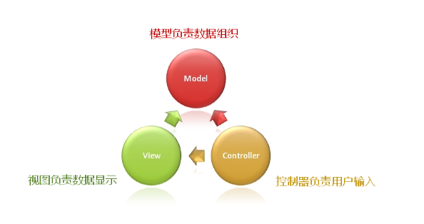

- [视图中的委托](#视图中的委托)
  - [QT模型视图中的委托](#qt模型视图中的委托)
- [自定义委托类](#自定义委托类)
  - [委托的本质](#委托的本质)


# 视图中的委托

问题: 模型负责组织数据, 视图负责显示数据, 谁来负责编辑数据呢？



在QT中这种MVC模型是怎么样的呢？

* 在视图中集成了处理用户输入功能
* 视图将用户输入作为内部独立子功能实现


## QT模型视图中的委托

* 委托是视图中负责用户输入的部件
* 视图可以设置委托对象用于处理用户输入
* 委托对象负责创建和显示用户输入上下文(创建显示各种编辑器)


# 自定义委托类

## 委托的本质

* 为试图提供数据编辑的上下文
* 产生界面元素的工厂类(根据用户输入的数据类型动态创建特定的组件)
* 能够使用和设置模型中的数据

问题: 如何自定义委托类

对于需要自定义委托时, 继承```QItemDelegate```并需要重写几个虚函数

> 实际上根据QT文档, 是更推荐继承```QStyledItemDelegate```

* ```createEditor```创建编辑组件
* ```updateEditorGeometry```更新组件位置大小
* ```setEditorData```从模型中获取数据设置到编辑器
* ```setModelData```编辑好的数据保存到模型
* ```paint```渲染回调函数

```C++
QWidget* SubStyledItemDelegate::createEditor(QWidget *parent, const QStyleOptionViewItem &option, const QModelIndex &index) const
{
    QWidget* ret = nullptr;

    _index = index;

    qDebug() << "SubStyledItemDelegate::createEditor";

    if(index.data().typeId() == QMetaType::QChar)
    {
        QComboBox* cb = new QComboBox(parent);

        cb->addItem("a");
        cb->addItem("b");
        cb->addItem("c");

        ret = cb;
    }
    else if(index.data().typeId() == QMetaType::Bool)
    {
        QCheckBox* cb = new QCheckBox(parent);
        cb->setCheckState(Qt::Unchecked);
        cb->setText("choose...");

        ret = cb;
    }
    else
    {
        ret = QItemDelegate::createEditor(parent, option, index);
    }

    return ret;
}

void SubStyledItemDelegate::updateEditorGeometry(QWidget *editor, const QStyleOptionViewItem &option, const QModelIndex &index) const
{
    qDebug() << "SubStyledItemDelegate::updateEditorGeometry";

    editor->setGeometry(option.rect);
}

void SubStyledItemDelegate::setEditorData(QWidget *editor, const QModelIndex &index) const
{
    qDebug() << "SubStyledItemDelegate::setEditorData";

    if(index.data().typeId() == QMetaType::QChar)
    {
        QComboBox* cb = dynamic_cast<QComboBox*>(editor);
        if(cb)
        {
            for(int i = 0; i < cb->count(); i++)
            {
                if(cb->itemText(i).at(0) == index.data().toChar())
                {
                    cb->setCurrentIndex(i);
                }
            }
        }
    }
    else if(index.data().typeId() == QMetaType::Bool)
    {
        QCheckBox* cb = dynamic_cast<QCheckBox*>(editor);

        if(cb)
        {
            cb->setChecked(index.data().toBool());
        }
    }
    else
    {
        QItemDelegate::setEditorData(editor, index);
    }
}

void SubStyledItemDelegate::setModelData(QWidget *editor, QAbstractItemModel *model, const QModelIndex &index) const
{
    qDebug() << "SubStyledItemDelegate::setModelData";


    if(index.data().typeId() == QMetaType::QChar)
    {
        QComboBox* cb = dynamic_cast<QComboBox*>(editor);
        if(cb)
        {
            model->setData(index, cb->currentText().at(0), Qt::DisplayRole);
        }
    }
    else if(index.data().typeId() == QMetaType::Bool)
    {
        QCheckBox* cb = dynamic_cast<QCheckBox*>(editor);
        if(cb)
        {
            model->setData(index, cb->isChecked(), Qt::DisplayRole);
        }
    }
    else
    {
        QItemDelegate::setModelData(editor, model, index);
    }
}

void SubStyledItemDelegate::onCloseEditor(QWidget* editor)
{
    _index = QModelIndex();
    qDebug() << "SubStyledItemDelegate::onCloseEditor";
}

void SubStyledItemDelegate::onCommitData(QWidget* editor)
{
    qDebug() << "SubStyledItemDelegate::onCommitData";
}

void SubStyledItemDelegate::paint(QPainter *painter, const QStyleOptionViewItem &option, const QModelIndex &index) const
{
    if(_index != index)
    {
        QItemDelegate::paint(painter, option, index);
    }
}


```